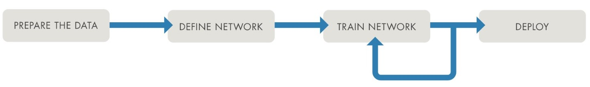
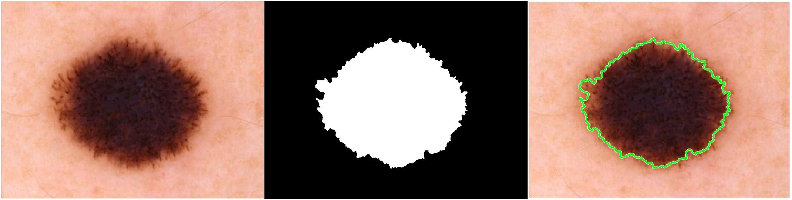

# Deep Learning for Computer Vision using Python and MATLAB
This repository shows an example of how to integrate MATLAB apps into a Python deep learning workflow for computer vision and image analysis tasks, with emphasis on the *data preparation* stage of the traditional deep learning workflow.

I will assume that: (1) you have a deep learning pipeline for computer vision in Python that you plan to adapt and reuse for a new (set of) task(s); and (2) the images associated with the new task(s) will require interactive actions, such as annotation, labeling, and segmentation. 

## The basic recipe
Assuming that you have [MATLAB installed and configured in your machine](https://www.mathworks.com/products/get-matlab.html) and your favorite Python setup (e.g., using Jupyter notebooks), calling MATLAB from a Python script is a straightforward process, whose main steps are:

1.	(In MATLAB) Install the [MATLAB Engine API for Python](https://www.mathworks.com/help/matlab/matlab_external/get-started-with-matlab-engine-for-python.html), which provides a Python package called `matlab` that allows you to call MATLAB functions and exchange data between Python and MATLAB.
2.	(In Python) Configure paths and working directory. 
3.	(In Python) Start a new MATLAB process in the background:

`import matlab.engine`

`eng = matlab.engine.start_matlab('-desktop')`

4.	(In Python) Set up your variables (e.g., path to image folders).
5.	(In Python) Call a MATLAB app of your choice (e.g., Image Labeler app).
6.	(In MATLAB) Work (interactively) with the selected app and export results to variables in the workspace.
7.	(In Python) Save the variables needed for the rest of the workflow, e.g., image filenames and associated labels (and their bounding boxes).
8.	(In Python) Use the variables as needed, e.g., processing tabular data using pandas and using image-related labels as ground truth.
9.	Repeat steps 3 through 7 as many times as needed in your workflow.
10.	(In Python) Quit the MATLAB engine:

`eng.exit()`
## An example
Here is an example of how to use Python and MATLAB together for two different tasks within the scope of medical image analysis (using deep learning): skin lesion segmentation and (medical) image (ROI) labeling.
### Task 1: Skin Lesion Segmentation
**The Task**: Given a dataset of images containing skin lesions, we want to build a deep learning solution for segmenting each image, i.e., classifying each pixel as belonging to either the lesion (foreground) or the rest of the image (background). 

**The Problem**: In order to train and validate a deep neural network for image segmentation, we need to input both the images as well as the segmentation masks, which are essentially binary images where foreground pixels (in this case corresponding to the lesion) are labeled white and background pixels are marked as black. The job of the network is to learn the segmentation masks for new images.

The basic workflow usually consists of using convolutional network architectures, such as U-net and its variations, for which there are multiple examples of implementation in Python and MATLAB. A crucial component of the solution, however, is the manual creation of the binary masks needed for training and validation. Except for a few publicly available datasets, this time-consuming and specialized task must be performed using a powerful interactive tool. 

**The Solution**: Use the [MATLAB Image Segmenter app](https://www.mathworks.com/help/images/image-segmentation-using-the-image-segmenter-app.html) to create the binary masks and leverage the existing (Python, for the sake of this example) workflow for everything else. Image Segmenter allows you to create masks manually and provides several (semi-)automatic techniques to speed up the process and refine the results. Both the final segmentation mask image and the segmented version of the original image can be exported to the MATLAB workspace and/or saved to disk.

### Task 2: (Medical) Image (ROI) Labeling
**The Task**: In a similar context to Task 1, we want to build a deep learning solution for detecting regions of interest (ROIs) in each image, i.e., placing a boundary around each relevant region in the image. The most common ROI will be a lesion; other possible ROIs could include stickers, ruler markers, water bubbles, ink marks, and other artifacts.

**The Problem**: To train and validate a deep neural network for ROI/object detection, we need to input both the images as well as the labels and coordinates of the relevant ROIs, which can be expressed as rectangles (most common), polygons, or pixel-based masks (similarly to the masks used in segmentation). The job of the network is to learn the location and labels of the relevant ROIs for new images.

Once again, similarly to what we saw in Task 1, a crucial component of the solution is the manual creation of the ROIs (polygons and labels) needed for training and validation. Except for a few publicly available datasets, this time-consuming and specialized task must be performed using a powerful interactive tool. 

**The Solution**: Use the [MATLAB Image Labeler app](https://www.mathworks.com/help/vision/ug/get-started-with-the-image-labeler.html) to create and label the ROIs and leverage the existing workflow for everything else. Image Labeler allows you to create ROI labels of different shape, assign them different names and colors, and provides several algorithms to help automate and speed up the process and refine the results. The resulting ROIs can be exported to the MATLAB workspace and subsequently used as variables in your Python code.
## Requirements
- [X]  [MATLAB 2021a](https://www.mathworks.com/products/matlab.html) or later
- [X]  [Image Processing Toolbox](https://www.mathworks.com/products/image.html)

## Suggested steps
1. Download or clone the repository.
2. Open MATLAB.
3. Ensure that the files `AT2Scan.jpg` and `FakePred2.jpg` containing the test images for Part 2 are in the same folder as the `cpath_matlab.mlx` file. 
4. Run the `cpath_matlab.mlx` script and inspect results.
## Additional remarks

- You are encouraged to expand and adapt the example to your needs.
